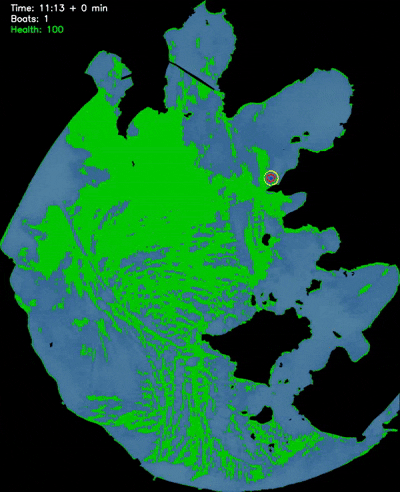
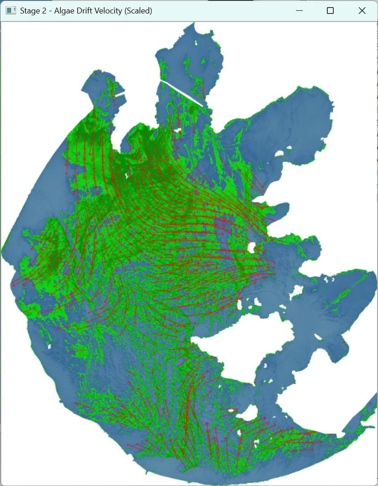

# 🌊 太湖藻华爆发推演与管控系统 (Algal Bloom Simulation)


> **高级语言程序设计(进阶) 课程作业 - 2025年秋季** > **开发者**：岳立峰 (同济大学 国豪书院)

## 📌 项目演示 (Demo)
*太湖镇水源地保卫战 —— 动态打捞资源调度仿真过程演示：*

<div align="center">
  
</div>

---

## 📖 1. 项目背景与技术定位
太湖作为长三角地区重要的饮用水源地，传统的水动力数值模拟难以满足突发的**实时应急响应**。本项目采用**数据驱动**思路，基于 C++ 与 OpenCV 视觉库，从零构建了一套**“数据解析 - 视觉推演 - 前端展示”的全链路管线 (Pipeline)**。

> **💡 工业界技术映射 (Technical Highlights)：**
> 本项目虽以生态推演为应用场景，但底层架构高度契合**游戏引擎、视觉算法管线与 AI 工具链**的开发逻辑：
> - **传统 CV 分割：** 基于 OpenCV 与大津法 (Otsu) 的自适应掩码提取，展现扎实的传统视觉底层能力。
> - **Motion Vectors 计算：** 实现 Farneback 稠密光流算法反演流场，逻辑同构于游戏渲染中的时域抗锯齿 (TAA)。
> - **物理与粒子模拟：** 运用拉格朗日平流扩散方程，实现类似 2D 流体/特效的高帧率演算与资源调度博弈。
> - **LLM 协同前端开发：** 重视工具易用性，通过大模型辅助极速构建响应式前端展示页，打通算法部署的“最后一公里”。

---

## 🧮 2. 核心原理与数学推导

### 2.1 遥感影像解析与 NDVI 特征提取
系统集成 `GDAL` 库读取 `.tif` 多光谱卫星数据。利用近红外(NIR)和红光(Red)波段计算归一化植被指数 (NDVI)，并使用大津法 (Otsu) 进行自适应阈值分割提取藻华掩码。
$$NDVI = \frac{Band_{NIR} - Band_{Red}}{Band_{NIR} + Band_{Red}}$$

### 2.2 基于 Farneback 稠密光流的流场反演
利用两期 NDVI 影像，基于亮度守恒假设，输入 `cv::calcOpticalFlowFarneback` 算法反演出表面流速矢量场 $\vec{V}(x,y)$。
$$I(x, y, t) = I(x + \Delta x, y + \Delta y, t + \Delta t)$$

### 2.3 拉格朗日平流扩散与博弈模拟
将藻华像素视为粒子，在拉格朗日坐标系下利用流速矢量进行位置更新。在 `AlgaeSalvageSim` 模块中，引入“水源地生命值”机制，采用贪心算法动态计算所需的打捞船数量，模拟藻华扩散与打捞清理的动态博弈。
$$\vec{P}_{t+\Delta t} = \vec{P}_t + \vec{V}(\vec{P}_t) \cdot \Delta t$$

---

## 🚀 3. 开发环境与依赖项
本项目在 Windows 环境下开发，依赖以下第三方库：
* **C++ Compiler**: 支持 C++ 14 或以上 (如 MSVC / MinGW)
* **OpenCV (4.x)**: 核心图像处理、光流计算与界面 GUI 可视化 (`core`, `imgproc`, `video`, `highgui`)
* **GDAL**: 用于读取包含地理坐标系的多光谱 TIFF 遥感影像

---

## 🖼️ 4. 阶段结果展示

### Stage 1: 藻华分布提取 (NDVI)
提取高对比度的藻华掩码，并进行伪彩色映射。
<div align="center">
  
</div>

### Stage 2: 表面流场矢量场反演 (Velocity Field)
利用光流法计算出的太湖局部水域藻华漂移流速矢量。
<div align="center">
  
</div>

### Stage 3: 水源地保护仿真 (Salvage Simulation)
绿色圆圈为打捞船作业范围，红色像素为逼近警戒区的危险藻华。
<div align="center">
  
</div>

---

## 📁 5. 项目结构
```text
Algal-Bloom-Simulation/
│
├── images/                   # Markdown与网页展示素材
│   ├── salvage_demo.gif
│   └── ...
│
├── main.cpp                  # 主程序入口
├── ImageProcessor.cpp/h      # GDAL数据读取与NDVI提取
├── AlgaeTracker.cpp/h        # Farneback光流流场计算
├── AlgaeSimulator.cpp/h      # 平流扩散位置推演
├── AlgaeSalvageSim.cpp/h     # 打捞船调度博弈仿真模块
│
├── .gitignore                # Git忽略文件配置
├── index.html                # GitHub Pages 项目主页
└── README.md                 # 项目说明文档
